# ecommerce-backend-orm

Internet retail, also known as **e-commerce**, is the largest sector of the electronics industry. E-commerce platforms like Shopify and WooCommerce provide a suite of services to businesses of all sizes. Due to their prevalence, understanding the fundamental architecture of these platforms is important as a Full Stack Developer.

This application is the back end for an e-commerce site. It uses an Express.js API and configured using Sequelize to interact with a MySQL database.

The application will be invoked by using the following command:

```md
node server.js
```

## Required Packages:

[MySQL2](https://www.npmjs.com/package/mysql2) and [Sequelize](https://www.npmjs.com/package/sequelize) packages are used to connect Express.js API to a MySQL database and the [dotenv](https://www.npmjs.com/package/dotenv) package enables environment variables to store sensitive data.

## User Story

```md
AS A manager at an internet retail company
I WANT a back end for my e-commerce website that uses the latest technologies
SO THAT my company can compete with other e-commerce companies
```

## Acceptance Criteria

```md
GIVEN a functional Express.js API
WHEN I add my database name, MySQL username, and MySQL password to an environment variable file
THEN I am able to connect to a database using Sequelize
WHEN I enter schema and seed commands
THEN a development database is created and is seeded with test data
WHEN I enter the command to invoke the application
THEN my server is started and the Sequelize models are synced to the MySQL database
WHEN I open API GET routes in Insomnia for categories, products, or tags
THEN the data for each of these routes is displayed in a formatted JSON
WHEN I test API POST, PUT, and DELETE routes in Insomnia
THEN I am able to successfully create, update, and delete data in my database
```

# Application Interaction:

**The following screenshots show the application's GET / POST / PUT / DELETE routes to retreive, create, update and delete categories, products, and tags being tested in Insomnia:**

- Insomnia - "GET All Categories", "GET All Products", "GET All Tags":

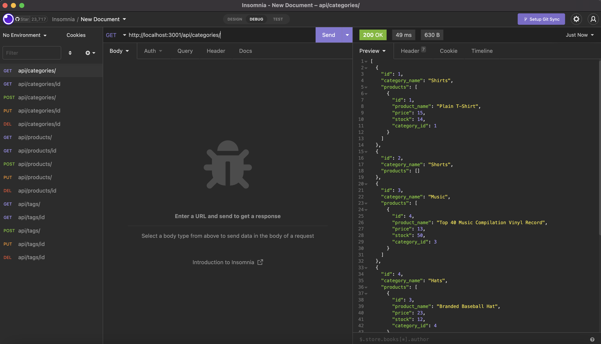

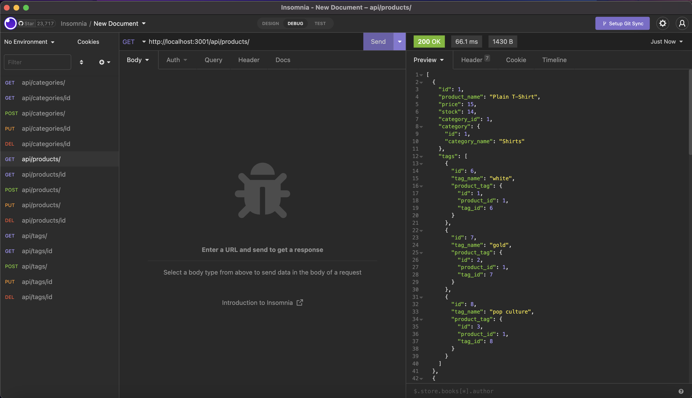

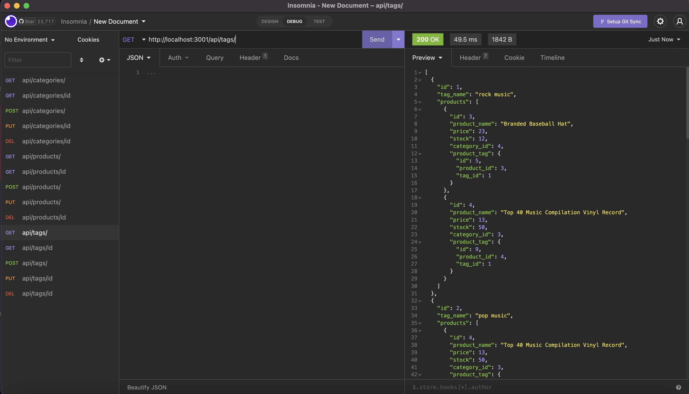

- Insomnia - "GET Categories by ID", "GET Products by ID", "GET Tags by ID":

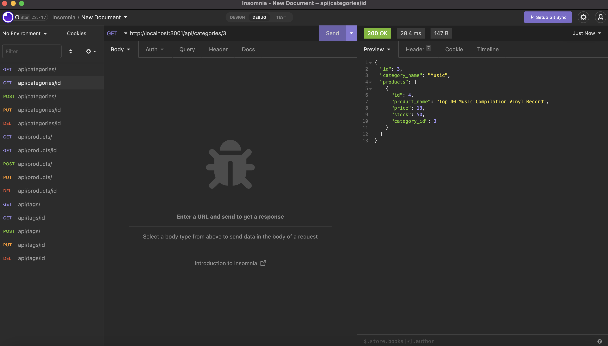

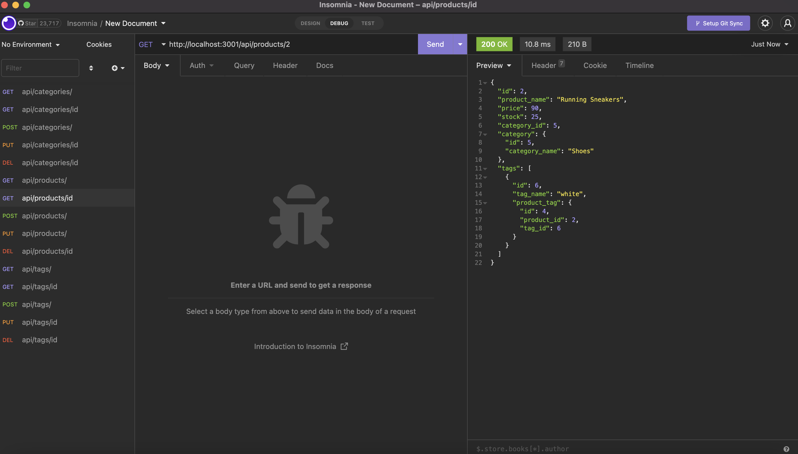

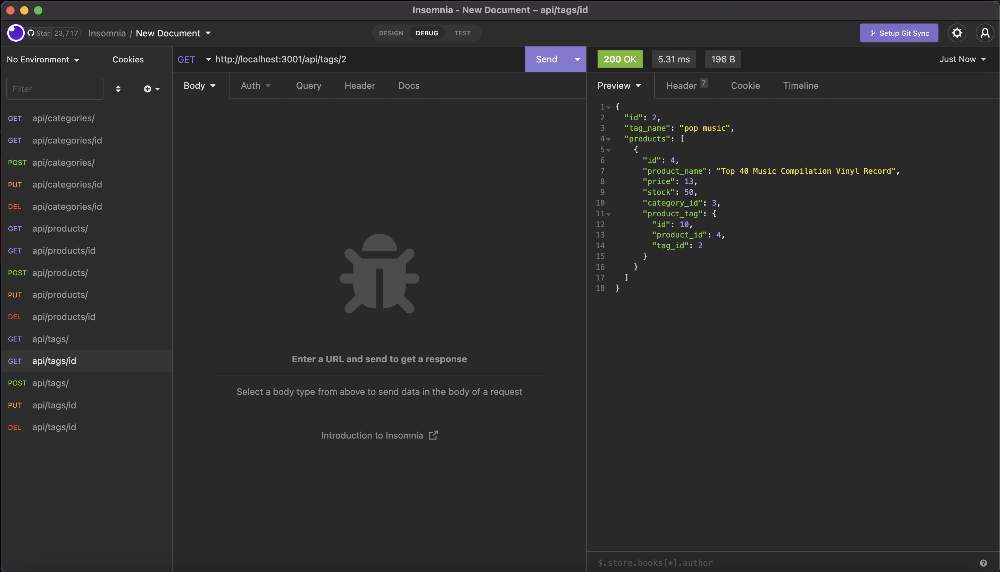

- Insomnia - "POST Categories", "POST Products", "POST Tags":

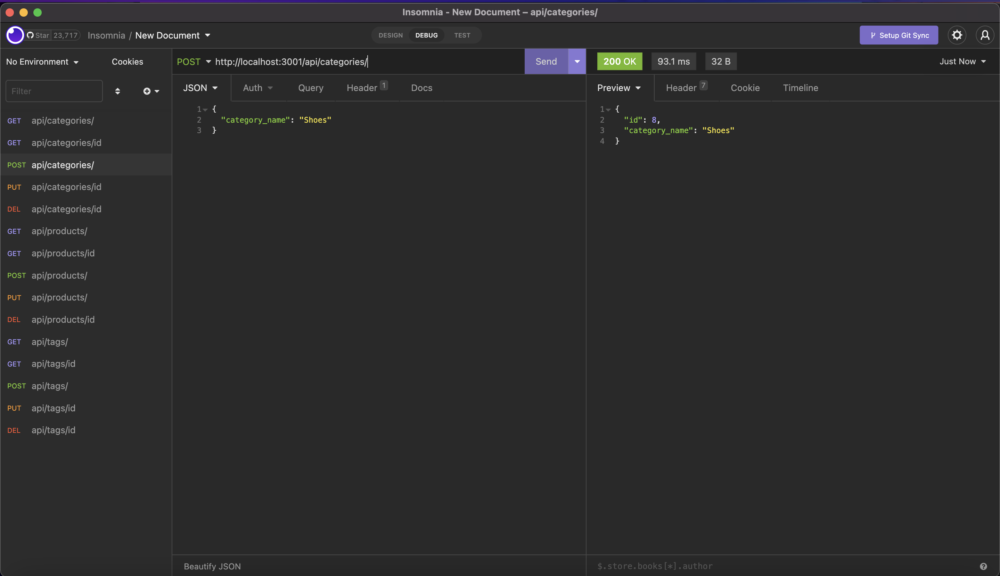

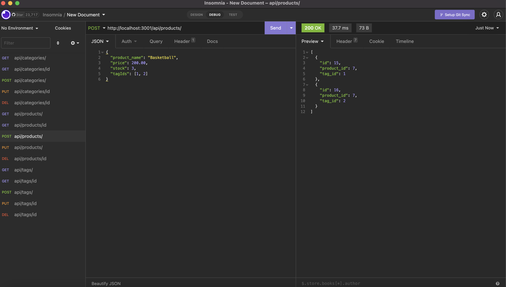

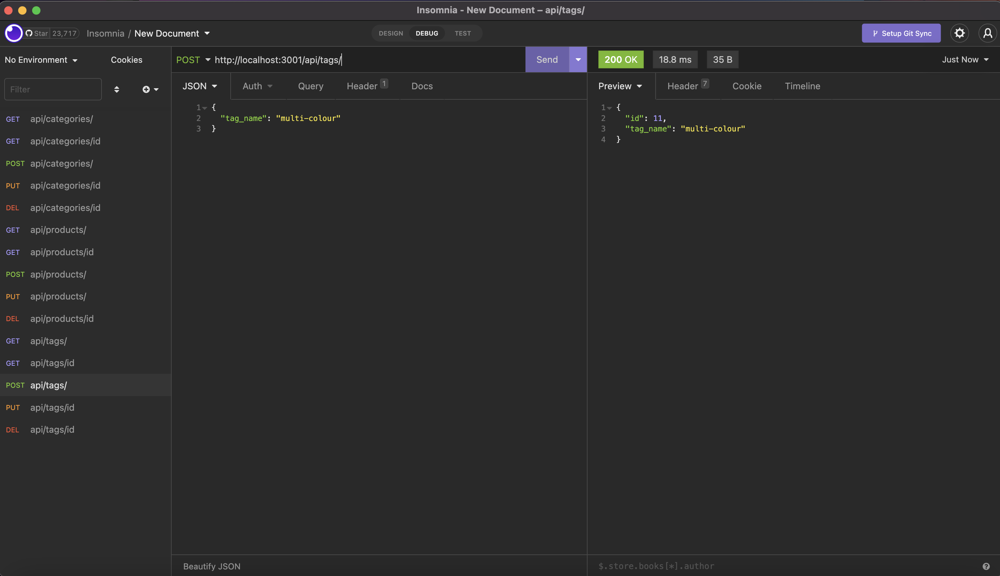

- Insomnia - "PUT Categories by ID", "PUT Products by ID", "PUT Tags by ID":

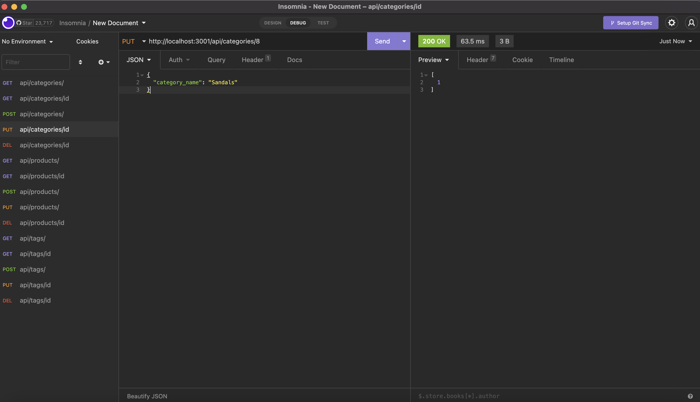

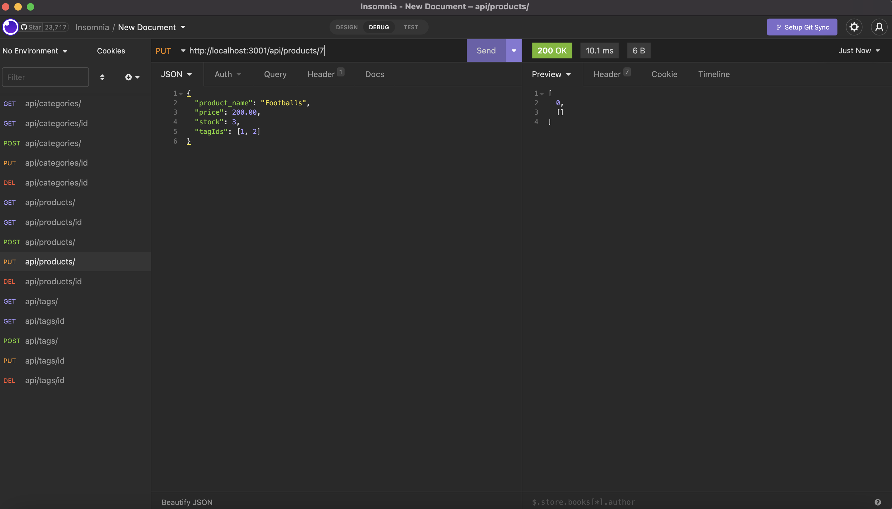

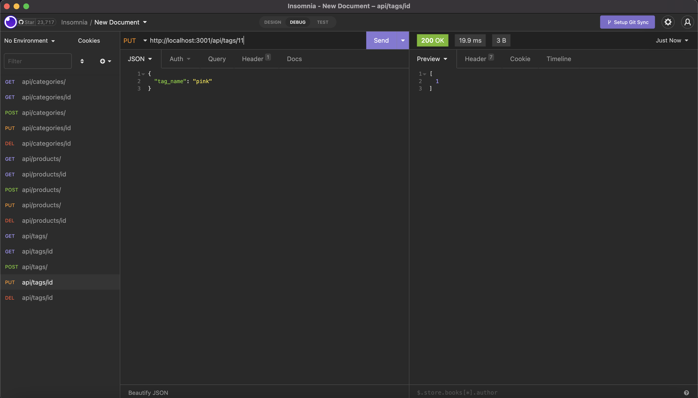

- Insomnia - "DELETE Categories by ID", "DELETE Products by ID", "DELETE Tags by ID":


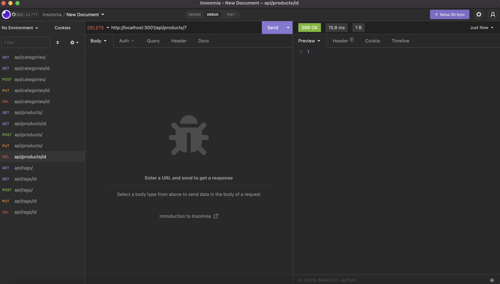

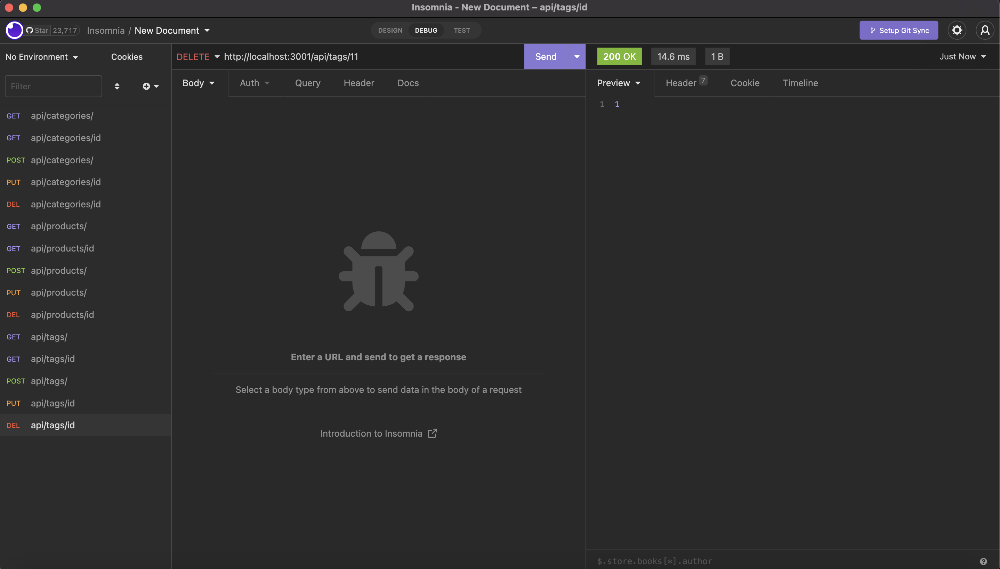

# Walk-through Video of Application Interaction:

[Click here](https://www.youtube.com/watch?v=mRa0fiJhexw&ab_channel=PriscillaLuong)

### Final note:

_Any feedback to improve code or implement best practice would be appreciated_ 😊
